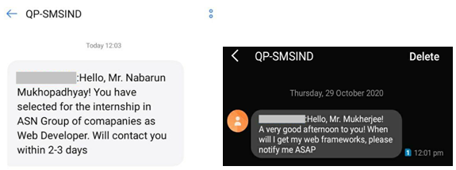

# Messenger-2.0.1
In this Python project I have created a Messenger which can send the sms to the phone number with the help of the API generator.

## Sending Messages using Python Programming language
### Prepared by, Abhishek Sharma

_Here's the whole documentation for the project <a href = "https://github.com/abhisheks008/Messenger-2.0.1/blob/main/Messenger%20Documentation.docx"> Click Here </a>_

The project work has two parts, the first one is the coding part with the Python programming language and second one is creating the GUI of the project to make it more attractive. Firstly I am going to talk about the Main coding part and what are the components and resources used to this.

#### Step 1:
I have used the Fats2Sms website for the API generation and sending the sms to the numbers.  <a href = "https://www.fast2sms.com">Link of the website</a>

#### Step 2:
Create an account in the website and you will get 50.00 rupees bonus. and here per sms costs 20 paisas only. 

#### Step 3:
Collect and select the sender ID from the section of the bulk sms dashboard, choose any one of them.

**_Here I have chosen the last one that is "SMSIND", you guys can anyone of them._**

#### Step 4:
Go to the dev API section and you will get the API authorization key, which will be your API authorization key and have to be used in the purpose of sending the sms through this gateway. 

#### Step 5:
In the Dev API section there is "To read API documentation", click there and a new window will open up. From there scroll down a bit and you will get the Get Method and HTTP request and copy the link from the section and use the link in the URL portion of the main code. <a href = "https://docs.fast2sms.com/#get-method">Link for the section</a>

#### Step 6:
Fill all the requirements and attach the GUI code in the main file just copy and paste it and use the messenger in your own use.

#### Remember :
One thing should be remembered that the internet will be on while sending the message because it's completely based on the internet without which it can't process the request and it will show that the error has occured. 

**Here are some images that the messages have sent to the recipients',**

These kind of messages will be received at the recipients'' end. As the messages are sent by the internet and they are system generated.
